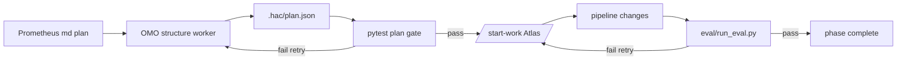

# Oh-My-OpenCode / Oh-My-OpenAgent Best Practices

A guide for building **HiAgentControl**: a gated research → plan → build → evaluate workflow on top of the canonical oh-my-openagent (OMO) harness—not a reimplementation of it.

**Primary references**

- [Features reference](https://github.com/code-yeongyu/oh-my-openagent/blob/dev/docs/reference/features.md)
- [Configuration reference](https://github.com/code-yeongyu/oh-my-openagent/blob/dev/docs/reference/configuration.md)
- [Orchestration guide](https://github.com/code-yeongyu/oh-my-openagent/blob/dev/docs/guide/orchestration.md)
- [Team mode guide](https://github.com/code-yeongyu/oh-my-openagent/blob/dev/docs/guide/team-mode.md)
- [Repository `dev` branch](https://github.com/code-yeongyu/oh-my-openagent/tree/dev)

---

## 1. Executive summary: you are not wrong, but the PoC fights the harness

Your instinct is correct: **oh-my-openagent already implements most of what HiAgentControl’s Python loop does**, but as **one continuous orchestration session** with hooks, delegation, and config—not as four separate `oh-my-opencode run` subprocesses.

| What you built (HiAgentControl PoC) | What OMO already provides |
| --- | --- |
| Sequential `research → structurer → pipeline → eval` in Python | **Prometheus** (plan) → **Atlas** (`/start-work`) with `task()` delegation |
| Four fixed agent names + prompt files | **@agent** mentions, categories, skills, built-in agents |
| Prompt-based “only read mnist” | **OpenCode `permission`** + `external_directory` in `opencode.json` |
| “Don’t stop until deliverable” | **todo-continuation-enforcer**, **ralph-loop**, `/ulw-loop` |
| Per-stage deliverables in `runs/` | **`.omo/plans/`**, **`.omo/notepads/`**, session tools, optional product layer |
| Gate review as a fourth agent stage | **Unified gate runner** (pytest / eval scripts), not a separate evaluator agent |
| Separate `StructuredOutputService` required | **Optional**; default = OMO structure worker + plan pytest gate |

**Recommendation:** Treat HiAgentControl as a **product shell** (baseline capture, metrics UX, artifact indexing, optional strict JSON) and let **OMO + OpenCode config** own orchestration, permissions, and continuation.

---

## 2. Canonical mental model (how OMO is meant to work)

OMO is a **plugin on OpenCode**. It adds agents, hooks, commands, skills, and MCPs. The intended flow is **separation of planning and execution**, not “run four different CLIs in a row.”

### 2.1 Three layers (from the orchestration guide)

```text
Planning     →  Prometheus (+ Metis consult, Momus review)
Execution    →  Atlas (conductor; reads plan, delegates, verifies)
Workers      →  Sisyphus-Junior (via task category), Explore, Librarian, Oracle, …
```

- **Prometheus** interviews, researches (via explore/librarian), writes plans under **`.omo/plans/`** (markdown only in that area).
- **Atlas** does **not** implement features itself; it **delegates** with `task(category=…)` or `task(subagent_type=…)`.
- **Sisyphus** is the default **primary** orchestrator for open-ended work (`ultrawork` / `ulw`).

### 2.2 When to use what (official decision table)

| Complexity | Canonical approach |
| --- | --- |
| Quick fix, one file | Normal prompt in OpenCode |
| Complex, lazy context | `ultrawork` or `ulw` — Sisyphus figures it out |
| Complex, precise multi-step | **`@plan`** (Prometheus) → **`/start-work`** (Atlas executes plan) |

You do **not** need a custom Python stage runner for the middle case unless you are building a **hosted product** that must persist artifacts outside OpenCode sessions.

### 2.3 Invoking agents the canonical way

In the OpenCode UI / CLI session:

```text
@prometheus Plan improvements to beat baseline.json without increasing latency_ms
@oracle Review whether data augmentation fits our train.py constraints
@explore Find all training and eval entrypoints
```

Or delegate inside a session (Atlas / Sisyphus):

```typescript
task({ subagent_type: "explore", prompt: "Map pipeline/ and eval/ and baseline.json" })
task({ category: "deep", prompt: "TASK: add LR scheduler … EXPECTED: eval/run_eval.py passes" })
```

**`task(category=…)`** routes to **Sisyphus-Junior** with the right model preset. **`task(subagent_type=…)`** calls a named subagent (explore, librarian, oracle, …). Category and `subagent_type` are **mutually exclusive** in one call.

### 2.4 Continuation until done (config + hooks, not custom loops)

OMO continues work via:

| Mechanism | Purpose |
| --- | --- |
| **todo-continuation-enforcer** | If todos are incomplete, agent is pushed back to work |
| **/ralph-loop** / **/ulw-loop** | Self-referential loop until completion signal or max iterations |
| **experimental.task_system** | File-backed tasks with `blockedBy` / parallel execution |
| **/start-work** | Atlas executes a Prometheus plan systematically |

`oh-my-opencode run` waits until **todos are done and background tasks are idle**—that is already a form of “don’t exit early.”

For **shell-level gates** after a run:

```bash
oh-my-opencode run --directory ./mnist --on-complete "python eval/run_eval.py" "Improve accuracy per baseline.json"
```

Use exit codes from your eval script (`0` = pass, non-zero = fail) in CI or a thin wrapper.

---

## 3. Mapping your big-picture product to OMO primitives

Your target product:

1. User has a repo with **pipeline → results** and a **metric** (e.g. accuracy / latency).
2. Agents **plan** experiments/changes with deep research; each task has **goal + gated success criteria**.
3. Agents **execute** tasks until gates pass or retries exhaust.
4. Optional **merge** (git).

### Phase A — Baseline & workspace (mostly your code, little OMO)

| Step | Owner | Notes |
| --- | --- | --- |
| Scaffold `baseline.json`, `pipeline/`, `eval/` | HiAgentControl template | You already did this for MNIST |
| Record baseline metrics | Script or one-shot `oh-my-opencode run` | `python pipeline/train.py && python eval/run_eval.py` |
| Scope & permissions | **`mnist/.opencode/opencode.json`** | `external_directory: deny`, `bash` patterns for eval only in eval phase |

OMO does not replace your **domain layout** (pipeline vs eval). It replaces **how agents are orchestrated inside that layout**.

### Phase B — Deep plan with research (Prometheus, not “research agent #1”)

**Canonical:**

```text
cd <target-repo>
@prometheus
Improve <metric> without regressing <constraint>.
Baseline: baseline.json.
Pipeline code lives in pipeline/; verification in eval/.
Each planned task must cite eval gate paths and thresholds.
```

Outputs:

- `.omo/plans/<name>.md` — single source of truth
- Optional Metis gap analysis, Momus review for high-stakes plans

**Avoid:** A separate “researcher” stage that duplicates Prometheus + explore/librarian, then a “structurer” stage that duplicates the plan format. Use **Prometheus for markdown planning**, then an **OMO structure worker + plan pytest gate** (see §12)—not a required Instructor service.

### Phase C — Plan → tasks with gates (plan markdown + task system)

In the Prometheus plan, each task should include what OMO already expects (see task prompt guide in features doc):

1. **TASK** — one objective  
2. **EXPECTED OUTCOME** — deliverable  
3. **MUST DO / MUST NOT DO**  
4. **CONTEXT** — paths (`pipeline/train.py`, `eval/run_eval.py`)  
5. **GATE** — e.g. `python eval/run_eval.py` exits 0 and `accuracy >= baseline`

Enable file-backed dependencies when needed:

```jsonc
// .opencode/oh-my-openagent.jsonc
{
  "experimental": { "task_system": true }
}
```

Then Atlas (via `/start-work`) can use **TaskCreate / TaskUpdate** with `blockedBy` for ordering (train before eval, etc.).

### Phase D — Execute until gates pass (Atlas + Junior + bash policy)

**Canonical execution:**

```text
/start-work <plan-name>
```

Atlas delegates implementation to **Sisyphus-Junior** (`task(category="deep")` or `"unspecified-high"`), passes accumulated **notepad wisdom** under `.omo/notepads/<plan>/`.

**Gating strategies (pick one or combine):**

| Strategy | How |
| --- | --- |
| **Plan-level acceptance** | Momus / evaluator section in plan: “run `eval/run_eval.py`” |
| **Bash permission patterns** | Allow `python eval/run_eval.py`, `pytest tests/`, deny ad-hoc training until ready |
| **Ralph loop** | `/ralph-loop "… until eval/run_eval.py passes and metrics beat baseline"` |
| **on-complete hook** | `oh-my-opencode run --on-complete 'python eval/run_eval.py'` |
| **Claude Code hooks** | `PostToolUse` → run tests (`.claude/settings.json`) |

**Retries:** Encode in the plan (“max 3 attempts per task”) or in a thin HiAgentControl runner that re-prompts Atlas with failure output—not four new agent personalities.

### Phase E — Optional merge

Use built-in **`git-master`** skill or `@prometheus` / Atlas with `category: "git"` for atomic commits—not a custom “merge agent.”

---

## 4. What the HiAgentControl PoC did vs best practice

### 4.1 Anti-patterns (reduce over time)

1. **Four sequential `oh-my-opencode run` calls** — cold sessions, no shared todo state, no Atlas wisdom accumulation, higher latency.  
2. **Renaming stages to agents incorrectly** — e.g. Prometheus as “structurer” and Atlas as “pipeline designer” fights each agent’s built-in role.  
3. **Duplicating orchestration in Python** — `MnistPlanningProcess.run_loop` mirrors `/start-work` + hooks poorly.  
4. **Prompt-only scope** — use `opencode.json` permissions (you moved toward this; keep it).  
5. **Separate “evaluator agent” for gates** — prefer **scripts + exit codes**; use Momus/Prometheus review for *plan* quality, Hephaestus/Oracle for *code* review if needed.  
6. **Structured output as a required pipeline stage** — keep Instructor/OpenRouter as **optional** post-processing for APIs, not in the hot path.

### 4.2 Keep from HiAgentControl (good product value)

| Component | Role |
| --- | --- |
| `baseline.json` + `pipeline/` + `eval/` | Domain contract for any target repo |
| `mnist/.opencode/*` | Per-project permissions |
| `runs/<ts>/` artifacts | Audit trail / UI (optional; not OMO’s native store) |
| `structured_output_service.py` | Strict JSON when the app needs schemas |
| Scope audit in `run_summary.json` | Product telemetry, not enforcement |

---

## 5. Recommended target architecture

```text
┌─────────────────────────────────────────────────────────────┐
│  HiAgentControl (product)                                      │
│  - baseline wizard, metrics dashboard, run history UI        │
│  - optional JSON API (structured_output_service)             │
│  - template repos (mnist, …)                               │
└───────────────────────────┬─────────────────────────────────┘
                            │ configures & records
                            ▼
┌─────────────────────────────────────────────────────────────┐
│  Target repo (user project)                                  │
│  baseline.json | pipeline/ | eval/ | .opencode/ | .omo/      │
└───────────────────────────┬─────────────────────────────────┘
                            │ one session
                            ▼
┌─────────────────────────────────────────────────────────────┐
│  OpenCode + oh-my-openagent plugin                           │
│  Prometheus → .omo/plans/ → /start-work → Atlas → task()     │
│  Hooks: todo-continuation, ralph-loop, permissions           │
└─────────────────────────────────────────────────────────────┘
```

### 5.1 Suggested layout for a gated ML target repo

```text
my-project/
├── baseline.json              # canonical metrics + constraints
├── pipeline/                  # executable training/build code
├── eval/
│   └── run_eval.py            # gate script (exit 0 = pass)
├── .opencode/
│   ├── opencode.json          # permissions (read scope, bash gates)
│   ├── oh-my-openagent.jsonc  # agent overrides, task_system, ralph_loop
│   └── command/
│       └── hac-improve.md     # optional slash: "@plan + metrics context"
├── .omo/
│   ├── plans/                 # Prometheus output (canonical plan)
│   └── notepads/              # execution learnings per plan
└── AGENTS.md                  # project context (/init-deep)
```

### 5.2 Example permission config (gates via bash)

```json
{
  "$schema": "https://opencode.ai/config.json",
  "permission": {
    "external_directory": "deny",
    "read": { "*": "allow", "**/node_modules/**": "deny" },
    "edit": { "pipeline/**": "allow", "eval/**": "deny" },
    "bash": {
      "*": "ask",
      "python pipeline/*": "allow",
      "python eval/run_eval.py*": "allow",
      "pytest *": "allow"
    }
  }
}
```

Tune per phase: planning sessions can set `edit: deny` for Prometheus; execution sessions widen `pipeline/**` writes.

### 5.3 Example OMO config snippet

```jsonc
{
  "$schema": "https://raw.githubusercontent.com/code-yeongyu/oh-my-openagent/dev/assets/oh-my-opencode.schema.json",
  "experimental": { "task_system": true },
  "ralph_loop": { "enabled": true, "default_max_iterations": 30 },
  "agents": {
    "prometheus": {
      "prompt_append": "Plans must list measurable gates using scripts under eval/. Reference pipeline/ paths for implementation."
    },
    "atlas": {
      "prompt_append": "After each task, run the gate named in the plan. Do not mark complete until exit code 0."
    }
  }
}
```

### 5.4 Custom slash command (optional)

`.opencode/command/hac-plan.md` can wrap your product wording:

```markdown
---
description: Plan metric improvements with eval gates
---

@prometheus

Target metric and baseline are in baseline.json.
pipeline/ is executable code; eval/ is verification only.
Produce a plan where every task has:
- goal
- success criteria
- gate command (path under eval/)
```

Users run `/hac-plan` instead of relearning Prometheus prompts.

---

## 6. Team mode vs background agents (when to use which)

OMO offers **two different parallelism models**. They overlap in “run multiple agents at once” but differ in **coordination**, **agent eligibility**, and **fit for gated work**. Do not replace either with **fixed agent spawns in Python** (the HiAgentControl PoC pattern).

### 6.1 Three patterns (quick contrast)

| Pattern | Who starts it | Coordination | Best for |
| --- | --- | --- | --- |
| **Background `task()` / `call_omo_agent()`** | Primary agent (Sisyphus / Atlas) in the **same session** | Parent keeps working; pulls results via `background_output(task_id)` | Ad-hoc parallel **research**, search, review while lead continues |
| **Team mode** (`team_*` tools) | Lead after `team_create` | Shared **task list** + **mailbox** + optional **worktrees**; lead signs off | Sustained parallel **implementation** experiments with shared plan state |
| **Fixed spawn in application code** (e.g. `hiagentcontrol.tools.run_plan_only_loop` loop) | Your Python runner | None (cold sessions, no shared todos) | **Avoid** for orchestration—use for audit/UI only |

Canonical background usage (from [features](https://github.com/code-yeongyu/oh-my-openagent/blob/dev/docs/reference/features.md)):

```typescript
// Parent continues; fetch when ready
task({
  subagent_type: "explore",
  prompt: "Map pipeline/ and eval/; list gate entrypoints",
  run_in_background: true,
});
// … lead implements or plans …
background_output({ task_id: "bg_abc123" });
```

Team mode usage (from [team mode guide](https://github.com/code-yeongyu/oh-my-openagent/blob/dev/docs/guide/team-mode.md)):

```text
team_create → team_task_create (with blockedBy) → members claim/update
→ team_send_message (gate results) → lead team_task_update → team_delete
```

### 6.2 Background agents — what they are good for

**Background agents** are **delegated sub-sessions** launched by the **current primary agent** (Sisyphus, Atlas, Hephaestus). The parent does not block on completion; hooks such as **background-notification** alert when results are ready.

**Use background agents when:**

| Situation | Example (gated ML / HiAgentControl) |
| --- | --- |
| **Read-only research** while the lead keeps planning or coding | `explore` maps `pipeline/train.py`; `librarian` looks up PyTorch augmentation docs—in parallel |
| **Short-lived parallel lookups** (no shared task board needed) | Two explores: `pipeline/` vs `eval/` layout |
| **Post-implementation review** without blocking merge | `review-work` skill pattern: parallel QA subagents, parent synthesizes |
| **Oracle / Momus / Metis consultation** | Architecture or plan review via `task(subagent_type="oracle", …)` in background |
| **Parent owns the gate** | Lead runs `python eval/run_eval.py` after `background_output` confirms implementation is done |

**Agents that work well in background** (via `task(subagent_type=…)` or `call_omo_agent`):

- `explore`, `librarian`, `oracle`, `multimodal-looker`, and category-routed **Sisyphus-Junior** (`task(category="deep", run_in_background=true)`)

**Limitations:**

- No **shared team task list** across backgrounds—parent must merge results manually.
- No **per-member git worktrees**—parallel edits risk conflicts unless parent serializes writes.
- Background tasks are **ephemeral IDs**, not durable multi-hour team runs (unless parent keeps session open).

**Gated workflow placement:** **Before or during planning**, not as a substitute for execution gates:

```text
@prometheus
  └─ (internally) task(explore, background) + task(librarian, background)
  └─ writes .omo/plans/*.md with gate table

/start-work
  └─ Atlas may background explore for a mid-task file lookup
  └─ Atlas or Junior implements; lead runs eval/run_eval.py
```

### 6.3 Team mode — what it is good for

**Team mode** (opt-in: `team_mode.enabled: true`) spawns a **lead** plus up to **8 members** with **12 `team_*` tools**, durable state under `~/.omo/runtime/{teamRunId}/`, and optional **tmux** panes per member.

**Use team mode when:**

| Situation | Example (gated metric improvement) |
| --- | --- |
| **Multiple parallel experiments** that should not overwrite each other | Member A: augmentation in `worktreePath: ../wt-aug`; Member B: LR scheduler in `../wt-lr` |
| **Shared task graph** with dependencies | `team_task_create`: train task → eval gate task (`blockedBy`) → merge task |
| **Lead as gatekeeper** | Members `team_send_message` with `eval/run_eval.py` JSON; lead marks task complete only on pass |
| **Long-running coordinated refactor** split by area | Different members own different modules; shared `team_status` |
| **Role split: implementers vs verifier** | Two `deep` members implement; one `quick` member re-runs gates and reports |
| **Plan-quality “panel” before code** (skills pattern) | Analogous to built-in **hyperplan** (5 critics)—use team for **execution** panel, not Prometheus |

**Eligible team lead / members:** `sisyphus`, `atlas`, `sisyphus-junior` (category members), `hephaestus` (with teammate permission).

**Cannot be team members** (hard-reject): `prometheus`, `oracle`, `librarian`, `explore`, `metis`, `momus`. For those roles:

1. Run via **`@prometheus`** / `task(subagent_type="explore")` **before** `team_create`, or  
2. Let the **lead** delegate research with normal `task()` (not team membership).

**Team mode does not:**

- Run your gate script automatically on `team_task_update`—encode “must pass `eval/run_eval.py`” in task text + lead behavior (or bash hooks).
- Provide synchronous “wait for eval” RPC—mailboxes are **fire-and-forget**.
- Allow nested teams or member `delegate-task` (member budget defaults to 0).
- Replace **Prometheus planning**—plan first, team executes.

**Enable only when needed:**

```jsonc
// project: .opencode/oh-my-openagent.jsonc
{
  "team_mode": {
    "enabled": true,
    "max_parallel_members": 4,
    "max_members": 8,
    "tmux_visualization": false,
    "max_wall_clock_minutes": 120
  }
}
```

Restart OpenCode after changing `team_mode`; verify with `bunx oh-my-opencode doctor`.

### 6.4 Decision guide (gated workflows)

```text
Need parallel work?
├─ NO  → Single lead: ulw, /start-work, or /ralph-loop + eval gate
└─ YES → Is it read-only research / docs / review?
         ├─ YES → Background task(subagent_type=explore|librarian|oracle, run_in_background=true)
         │         Parent stays primary; no team_create
         └─ NO  → Is it parallel IMPLEMENTATION with shared tasks / worktrees / gate sign-off?
                  ├─ YES → team_mode + team_create (lead=atlas) + team_task_* + eval gates in task defs
                  └─ NO  → Foreground task(category=deep) from Atlas, or serial /start-work
```

| Your phase | Prefer | Avoid |
| --- | --- | --- |
| Baseline + permissions | Scripts + `opencode.json` | Team or background for this |
| Deep research for plan | Background **explore** / **librarian**; **@prometheus** | `team_create` for research-only |
| Single-threaded fix until gate passes | **/start-work** or **ralph-loop** | Team mode (overkill) |
| Try 3+ improvement hypotheses at once | **Team mode** + worktrees | Multiple background **deep** edits in one tree (conflicts) |
| Quick codebase map during implementation | **Background explore** | Spawning new `oh-my-opencode run` per stage |
| Product audit trail | HiAgentControl `runs/` indexer | Reimplementing team mailboxes in Python |

### 6.5 HiAgentControl PoC vs canonical parallelism

| PoC pattern | Canonical replacement |
| --- | --- |
| Python loop: researcher → structurer → pipeline → eval (4× `oh-my-opencode run`) | One session: **@prometheus** → **/start-work** (Atlas + `task()`) |
| “Research agent” as fixed stage #1 | **Background explore** + Prometheus, or `@prometheus` interview |
| “Evaluator agent” as fixed stage #4 | **`eval/run_eval.py`** + lead verification; optional **Momus** for *plan* review only |
| Spawning Sisyphus/Prometheus/Atlas by name in code per stage | **@agent** / lead **delegation** inside one session |
| Need parallel experiments | **Team mode**, not four subprocess stages |
| Need parallel search while lead codes | **Background agents**, not team mode |

### 6.6 Example: MNIST metric improvement

**Planning (no team):**

```text
@prometheus — plan tasks T1..T3; each cites python eval/run_eval.py and baseline.json
# Optional: Sisyphus backgrounds explore to read pipeline/train.py while you review plan
```

**Execution A — one winner path (no team):**

```text
/start-work improve-mnist
# Atlas → task(category=deep) per plan task; runs eval gate between tasks
```

**Execution B — parallel hypotheses (team):**

```json
// mnist/.omo/teams/mnist-improve/config.json
{
  "name": "mnist-improve",
  "lead": { "kind": "subagent_type", "subagent_type": "atlas" },
  "members": [
    { "kind": "category", "name": "exp-aug", "category": "deep",
      "worktreePath": "../wt-aug",
      "prompt": "T1 from plan. MUST message lead with eval/run_eval.py output before claiming done." },
    { "kind": "category", "name": "exp-sched", "category": "deep",
      "worktreePath": "../wt-sched",
      "prompt": "T2 from plan. Same gate." }
  ]
}
```

Lead: `team_create` → mirror plan tasks → compare gate metrics from mailboxes → pick worktree → merge.

**Not recommended:**

```python
# Anti-pattern: fixed sequential agents in Python
for stage in ["researcher", "structurer", "pipeline_designer", "evaluator"]:
    oh_my_opencode_run(agent=stage, ...)  # loses todos, team, background continuity
```

### 6.7 Combining both (allowed)

In one **long session**, a lead may:

1. **Background** explore/librarian during Prometheus planning.  
2. **/start-work** or **team_create** for execution.  
3. **Background** oracle for a quick design check while members still code in a team.  

Rules:

- Do not enable **team_mode** unless you will use `team_*` tools (extra hooks overhead).  
- Do not spawn **background deep** implementers that edit the **same** tree as the lead—use **team + worktrees** instead.  
- **Gates stay in `eval/`** for all patterns.

---

## 7. Practical workflows (copy-paste)

### Workflow 1 — Fast iteration (no formal plan)

```text
cd my-project
ulw
Beat baseline.json accuracy without latency_ms > 13. Run eval/run_eval.py to verify.
```

Sisyphus delegates explore/deep tasks; todo enforcer keeps going.

### Workflow 2 — Formal gated product (your vision)

```text
cd my-project
@prometheus …interview + plan with eval gates…
# review .omo/plans/*.md
/start-work <plan-name>
# Atlas executes; gates = bash + plan acceptance
```

Optional: `/ralph-loop "Execute plan X until all eval gates pass"`.

### Workflow 3 — CI / headless (minimal Python)

```bash
cd my-project
oh-my-opencode run --directory . --agent Atlas --json \
  --on-complete "python eval/run_eval.py" \
  "Execute task T-003 from .omo/plans/improve-mnist.md"
```

HiAgentControl Python only **parses JSON + records runs/**—no stage machine.

---

## 8. Migration path from current `hiagentcontrol.tools.run_plan_only_loop`

| Step | Action |
| --- | --- |
| 1 | Keep `mnist/` template + `.opencode` permissions |
| 2 | Add `AGENTS.md` or `/init-deep` for project context |
| 3 | Replace 4-stage loop with documented **@prometheus → /start-work** flow for MNIST |
| 4 | Deprecate `hiagentcontrol.tools.run_plan_only_loop` or shrink to **artifact recorder** wrapping one `oh-my-opencode run` |
| 5 | Move prompts from `.opencode/` or `hiagentcontrol/prompts/*.md` to **`.opencode/command/`** or **Prometheus `prompt_append`** |
| 6 | Use `eval/run_eval.py` as the gate; drop “evaluator agent” stage |
| 7 | Plan structure: OMO worker + pytest gate; Instructor adapter optional only |

---

## 9. FAQ

### Do I need separate agents in Python?

**No**, for orchestration. Use OMO agents and `task()` / `@agent`. Python is for product concerns: billing, UI, run DB, baseline capture, JSON schemas.

### Can one agent loop until unit tests pass?

**Yes**, via ralph-loop, ultrawork, todo-continuation-enforcer, and/or `--on-complete` / bash hooks—not via four subprocess stages.

### Why did our 4-stage loop feel slow?

Each `oh-my-opencode run` starts a server, waits for full agent completion, and does not share Atlas notepad state. One `/start-work` session amortizes that cost.

### Is Prometheus only for “structuring”?

Prometheus is a **full planner** (interview + research + `.omo/plans/`). A separate “structurer” stage is redundant unless you need **non-OMO JSON** (Instructor service).

### Where does HiAgentControl add unique value?

- Guiding users through **baseline recreation**  
- Presenting **plans and metrics** in a UI  
- **Correlating** gate results across retries  
- **Templates** for pipeline/eval layout  
- Optional **strict schemas** outside the agent session  

### Team mode or background agents for gates?

- **Gates** = always `eval/*.py` (or tests) + exit codes.  
- **Background agents** = parallel **research/review** while the lead continues.  
- **Team mode** = parallel **implementation** with shared tasks, worktrees, and lead sign-off on gate evidence.  
- **Neither** replaces Prometheus planning or `opencode.json` permissions.

### Do I need StructuredOutputService if I have gate tests?

- **No** for the default path: OMO worker writes `plan.json`; **pytest/Pydantic** is the gate; Python **`run_until_pass`** retries with validation errors.  
- **Optional** Instructor adapter only when OMO is unavailable or you want schema-at-generation without the harness.

---

## 10. Summary

| Principle | Practice |
| --- | --- |
| **Orchestration** | One OpenCode session; Prometheus plans; Atlas executes |
| **Research** | explore / librarian via `task()` or @mentions—not a custom stage |
| **Gates** | `eval/*.py` + exit codes + bash permissions + hooks |
| **Scope** | `opencode.json` in the target repo |
| **Continuation** | ralph-loop, todos, task_system—not manual loop_index in Python |
| **Parallelism** | Background `task()` for research; team mode for parallel gated experiments |
| **HiAgentControl** | Product + templates + artifacts, not a second agent OS |

Build the app **on** oh-my-openagent; configure and command it canonically; use Python for what the plugin cannot do (your dashboard, baseline wizard, and structured APIs).

---

## 11. How to build HiAgentControl modules (plan runner, task runner, gates)

When you add a **“run plan”** or **“run task”** module, split by **who owns the intelligence** vs **who owns the product contract**.

### 11.1 Layering rule (default)

| Layer | Technology | Owns |
| --- | --- | --- |
| **Policy & orchestration** | `.opencode/opencode.json`, `oh-my-openagent.jsonc`, `.omo/teams/*/config.json`, slash **commands**, **skills** | Permissions, agents, loops, team topology, prompt appendices |
| **Plan & task content** | Markdown under **`.omo/plans/`**, optional **`.omo/notepads/`** | What to do, gates per task, dependencies |
| **Truth for gates** | **`eval/*.py`**, `pytest`, shell | Pass/fail, metrics (exit code + JSON) |
| **Product / app** | **Thin Python** in `hiagentcontrol/` | Invoke harness, retry policy, parse results, UI/API, baseline capture |

**Do not implement agent orchestration in Python** (no fixed four-stage loop, no per-stage agent personalities). Python is a **driver and recorder**, not a second agent OS.

### 11.2 Module: “run plan” (create a plan)

**Goal:** Deep researched plan with tasks and gate criteria → artifact at `.omo/plans/<name>.md`.

| Approach | Use? | Notes |
| --- | --- | --- |
| **Config + slash command** | **Yes (primary)** | `.opencode/command/hac-plan.md` → user or app sends `/hac-plan` or `@prometheus` with your metric context |
| **Config only** | Partial | `agents.prometheus.prompt_append` encodes gate vocabulary; not a full “run” by itself |
| **Python orchestration** | **Thin only** | One subprocess: `oh-my-opencode run --directory <repo> --agent prometheus --json "<prompt>"` |

**Python `PlanRunner` should:**

- Resolve `workdir`, build prompt from template + `baseline.json` (or load `command/hac-plan.md` text).
- Call `OhMyBackend.run(...)` once.
- Return `{ session_id, plan_paths: glob(.omo/plans/*.md), stdout, success }`.
- Optionally copy plan to HiAgentControl DB / `runs/<id>/plan.md` for the UI.

**Python should not:** spawn research → structurer → pipeline designer chains.

**Config you should add:**

```markdown
# .opencode/command/hac-plan.md
---
description: Plan metric improvements with eval gates
---
@prometheus
…product-specific instructions…
```

### 11.3 Module: “run task” / “run plan execution” (execute work)

**Goal:** Carry out one plan task (or whole plan) until gates pass or retries exhausted.

| Approach | Use? | Notes |
| --- | --- | --- |
| **`/start-work` + Atlas** | **Yes (default single-tree)** | Plan already in `.omo/plans/`; execution stays inside one OMO session |
| **Team mode + team spec** | **Yes (parallel experiments)** | Config: `team_mode.enabled` + `mnist/.omo/teams/<name>/config.json`; lead runs `team_*` inside session—not from Python |
| **`/ralph-loop` / `ralph_loop` config** | **Yes (single thread until done)** | `ralph_loop.enabled` in jsonc; prompt includes gate command |
| **Background `task()`** | For research only | Not for main “run task” implementation |
| **Python per-agent stages** | **No** | Replaces OMO poorly |

**Python `ExecuteRunner` should:**

- **Mode `start_work`:** `oh-my-opencode run --agent atlas --json "/start-work <plan-stem>"` or prompt: “Execute `.omo/plans/foo.md`; run gate after each task.”
- **Mode `ralph`:** pass ralph-style completion criteria + gate script in prompt.
- **Mode `team`:** either document “user enables team in IDE” **or** single run with prompt “`team_create` from spec `mnist-improve` and execute plan X” (fragile headless—prefer interactive for team).
- **Retry policy (product):** if `--on-complete` gate fails, Python re-invokes with prior stderr (max N)—this is **your** loop, not a new agent role.

```python
# Pseudocode — product owns retries; OMO owns work inside each invoke
for attempt in range(max_retries):
    result = backend.run(agent="atlas", prompt=execute_prompt, on_complete="python eval/run_eval.py")
    if result.returncode == 0 and gate_passed(result):
        break
```

**Config you should add:**

```jsonc
{
  "experimental": { "task_system": true },
  "ralph_loop": { "enabled": true },
  "agents": {
    "atlas": {
      "prompt_append": "Execute plan tasks in order; run eval gate before marking complete."
    }
  }
}
```

### 11.4 Module: “run gate” (evaluation only)

**Goal:** Deterministic check—no LLM required.

| Approach | Use? |
| --- | --- |
| **Python `subprocess`** | **Yes — this module should be pure Python** |
| **OMO config** | Supports it (`bash` allow patterns, `--on-complete`) but does not replace the script |

```python
# hiagentcontrol/gate.py — no oh-my-opencode
def run_gate(eval_script: Path, workdir: Path) -> GateResult:
    completed = subprocess.run([sys.executable, str(eval_script)], cwd=workdir, capture_output=True)
    return GateResult(passed=completed.returncode == 0, stdout=completed.stdout, ...)
```

Use gates from Python to:

- Record baseline before any agent run.
- Verify after each `oh-my-opencode run` when using `--on-complete`.
- Drive CI without starting OpenCode.

### 11.5 Suggested `hiagentcontrol/` package layout

```text
hiagentcontrol/
├── backends/
│   └── ohmy.py              # OhMyBackend: one run invocation, JSON parse
├── runners/
│   ├── plan.py              # PlanRunner → prometheus / hac-plan
│   ├── execute.py           # ExecuteRunner → atlas /start-work | ralph
│   └── gate.py              # GateRunner → subprocess eval only
├── catalog/
│   └── plan_tasks.py        # Optional: parse .omo/plans/*.md for UI task list
├── record/
│   └── run_store.py         # Persist runs/<id>/ for product audit (not .omo replacement)
├── gates/                   # run_until_pass, ScriptGate, PytestGate
├── schemas/plan.py          # PipelineOutput (shared with pytest gate)
└── adapters/instructor_structure.py   # OPTIONAL; not default path
```

Deprecate or shrink: `planning_runtime.MnistPlanningProcess`, `mnist_process` stage lists, per-stage prompt directories used as a **pipeline**.

### 11.6 Decision matrix (your two modules)

| You want… | Config | OMO session (command / @agent) | Python |
| --- | --- | --- | --- |
| **Run plan** | `command/hac-plan.md`, `prometheus.prompt_append` | `/hac-plan` or `@prometheus` | `PlanRunner`: one `oh-my-opencode run`, copy `.omo/plans/` |
| **Run task (one plan, serial)** | `task_system`, `atlas.prompt_append`, bash rules | `/start-work` | `ExecuteRunner`: invoke + optional retry on gate fail |
| **Run task (parallel experiments)** | `team_mode`, `teams/*/config.json` | Lead uses `team_*` in session | Optional: only validate team spec + record `team_status` output |
| **Run gate** | bash permissions | `--on-complete` hook | **`GateRunner` only** (deterministic) |
| **Baseline snapshot** | — | — | `train.py` + `GateRunner` |

### 11.7 What stays in the target repo vs the Python package

| Artifact | Location |
| --- | --- |
| Permissions, agents, team mode | `<project>/.opencode/` |
| Plans, notepads, team runtime | `<project>/.omo/` |
| Pipeline + eval scripts | `<project>/pipeline/`, `<project>/eval/` |
| Product run history (optional) | HiAgentControl `runs/` or your DB—not a second plan format |

**Summary:** Use **config + OMO commands** for *what agents do and how they coordinate*. Use **Python** for *when to invoke the harness, gate subprocesses, retries, and UI/API*. Never use Python to *replace* Prometheus, Atlas, `task()`, or team mode.

---

## 12. Unified gate runner (and structuring without a separate service)

HiAgentControl can use **one core pattern** everywhere: produce an **artifact**, run a **deterministic gate** (script or pytest), **retry** until pass or max attempts. That applies to **plans** and **code/metrics** the same way.

### 12.1 Core loop (reusable component)

```text
repeat until pass or max_attempts:
  artifact = producer(feedback)     # may use OMO worker / Atlas / train.py
  result   = gate.check(artifact)   # NEVER an LLM — pytest, Pydantic, subprocess
  if result.passed: DONE
  feedback = result.errors          # fed into next producer attempt
```

| Phase | Producer | Gate (unit test / script) |
| --- | --- | --- |
| **Plan** | OMO worker writes `.hac/plan.json` from `.omo/plans/*.md` | `pytest tests/test_plan_contract.py` or `PipelineOutput.model_validate_json` |
| **Execute** | Atlas / `pipeline/train.py` | `python eval/run_eval.py` (exit 0) |
| **Optional merge** | git / skill | `pytest`, CI |

**Gates define “complete.”** Agents only **propose** artifacts; the product **admits** them when the gate passes.

### 12.2 Do you still need `StructuredOutputService`?

**No — not as a required architecture piece** — if you use an **OMO worker + plan gate + retry loop**.

| Approach | Stack | When to use |
| --- | --- | --- |
| **A. OMO worker + gate (recommended default)** | Prometheus → md; worker → json; **pytest/Pydantic gate**; Python `run_until_pass` | One harness, same retry story as metrics, simpler mental model |
| **B. `StructuredOutputService` (Instructor)** | Separate OpenRouter call with Pydantic at generation time | Optional: no OMO available, API-only tier, batch offline, or fewer retries when schema-at-generation is worth the extra dependency |

**Simpler architecture (A):**

```text
@prometheus  →  .omo/plans/foo.md
oh-my-opencode run (worker)  →  writes .hac/plan.json
pytest tests/test_plan_contract.py  →  exit 0 required
(retry worker with validation errors if fail)
/start-work  →  Atlas uses md plan + optional plan.json for UI
```

You drop a **second LLM stack** (Instructor/OpenRouter) for structuring. The **worker** is just another gated producer—like training is a gated producer for metrics.

**Keep `StructuredOutputService` only as an optional adapter**, e.g. `hiagentcontrol/adapters/instructor_structure.py`, not the main path.

### 12.3 OMO worker for structuring (canonical without Instructor)

Prometheus stays **markdown-only** (`.omo/plans/`). Structuring is a **separate worker step**, not Prometheus.

**Who does the worker job:**

| Option | How |
| --- | --- |
| **Delegated task (inside a session)** | Lead runs `task(category="quick" \| "unspecified-low", prompt="Convert .omo/plans/foo.md to .hac/plan.json per schema…")` |
| **Headless `oh-my-opencode run`** | `PlanStructureRunner`: one subprocess, agent Sisyphus or Atlas, write permission only under `.hac/` |

**Worker prompt essentials:**

- Input: path to `.omo/plans/<name>.md` + `baseline.json`
- Output: write **only** `.hac/plan.json` matching your schema (document fields in prompt or attach example fixture)
- On validation failure (next attempt): paste pytest/Pydantic errors verbatim

**Permissions** (`opencode.json`):

```json
{
  "permission": {
    "edit": {
      "*": "deny",
      ".hac/**": "allow"
    },
    "bash": {
      "python -m pytest tests/test_plan_contract.py*": "allow"
    }
  }
}
```

**Gate as `--on-complete` (single invoke):**

```bash
oh-my-opencode run --directory . --agent Sisyphus --json "…structure…" \
  --on-complete "python -m pytest tests/test_plan_contract.py -q"
```

OMO waits for the session to finish; your **product** still owns **retry across invokes** when the gate fails:

```python
# hiagentcontrol/gates/runner.py — same for plan and metrics
for attempt in range(max_attempts):
    backend.run(agent="sisyphus", prompt=structure_prompt(feedback), on_complete="pytest …")
    if plan_gate.passed():
        break
    feedback = plan_gate.stderr
```

Inside one invoke, **todo-continuation-enforcer** / **ralph-loop** can keep the worker going until it believes it is done; the **pytest gate** is still the objective truth before your app advances phase.

### 12.4 Plan “unit tests” (the gate for plan instances)

Treat plan validation like **unit tests on the plan mechanism**—not “did the agent sound confident?”

```python
# tests/test_plan_contract.py
def test_plan_json_valid(plan_json: Path):
    PipelineOutput.model_validate_json(plan_json.read_text())

def test_every_task_has_executable_exit_criteria(plan_json: Path):
    plan = PipelineOutput.model_validate_json(plan_json.read_text())
    for task in plan.tasks:
        assert task.exit_criteria
        for c in task.exit_criteria:
            assert c.kind in ("script", "test", "metric")
            assert c.path  # under pipeline/ or eval/
```

```bash
PLAN_JSON=.hac/plan.json python -m pytest tests/test_plan_contract.py -q
# exit 0 → plan phase complete; else retry worker with stderr
```

Share **Pydantic models** between gate tests and any optional Instructor adapter (`hiagentcontrol/schemas/plan.py`).

### 12.5 `GateRunner` package layout (updated)

```text
hiagentcontrol/
├── gates/
│   ├── base.py           # GateResult, Gate protocol
│   ├── runner.py         # run_until_pass(producer, gate, max_attempts)
│   ├── script.py         # ScriptGate — eval/run_eval.py
│   ├── pytest_gate.py    # PytestGate — tests/test_plan_contract.py
│   └── schema.py         # SchemaGate — inline Pydantic validate
├── schemas/
│   └── plan.py           # PipelineOutput, PipelineTask, ExitCriterion
├── runners/
│   ├── plan.py           # PlanRunner: prometheus → md
│   ├── structure.py      # StructureRunner: OMO worker + plan gate loop
│   └── execute.py        # ExecuteRunner: atlas + metric gate loop
├── backends/
│   └── ohmy.py
└── adapters/
    └── instructor_structure.py   # OPTIONAL; not default
```

Deprecate as **default path**: `structured_output_service.py` as a required pipeline stage. Keep file only if you expose an API that must run without OMO.

### 12.6 End-to-end gated flow (simplified)



| Step | LLM? | Gate |
| --- | --- | --- |
| Plan research + md | Yes (Prometheus) | Human optional review |
| Structure to json | Yes (OMO worker) | **pytest / Pydantic** |
| Execute tasks | Yes (Atlas / Junior) | **`eval/run_eval.py`** |
| Product UI advance | No | Only when gate for current phase passed |

### 12.7 Decision: worker + gate vs Instructor

| Criterion | OMO worker + gate | Instructor `StructuredOutputService` |
| --- | --- | --- |
| Architectural simplicity | **One agent stack** | Two stacks (OMO + OpenRouter) |
| Schema enforcement | At **check** time (pytest) | At **generation** time |
| Retries | Same `run_until_pass` as execution | Re-call Instructor with errors |
| Depends on OMO installed | Yes | No |
| Cost / model choice | Same OMO models | Separate cheap OpenRouter model |
| Best for HiAgentControl default | **Yes** | Optional fallback |

**Recommendation:** Default to **OMO worker + plan pytest gate + `run_until_pass`**. Document Instructor as optional for environments without OpenCode or for a strict HTTP API that only accepts JSON.

### 12.8 What to remove from the old PoC mental model

| Old idea | Replacement |
| --- | --- |
| Fourth agent “structurer” in Python loop | **StructureRunner** = one OMO worker + plan gate |
| Structuring = separate service you must call | Structuring = **gated producer** like training |
| “Done” when agent returns deliverable | **Done** when **gate exit 0** |
| `StructuredOutputService` required | **Optional adapter** only |

---

## 13. Related reading in this repo

- `README.md` — current PoC (legacy sequential runner)  
- `mnist/README.md` — pipeline vs eval layout  
- `mnist/.opencode/opencode.json` — permission enforcement example  
- [OpenCode permissions](https://open-code.ai/en/docs/permissions) — `read`, `bash`, `external_directory`  
- [Team mode guide](https://github.com/code-yeongyu/oh-my-openagent/blob/dev/docs/guide/team-mode.md) — `team_*` tools, worktrees, bounds  

*Document version: aligned with oh-my-openagent `dev` branch (May 2026). §11 module layering; §12 unified gates + OMO worker structuring (no required Instructor).*
